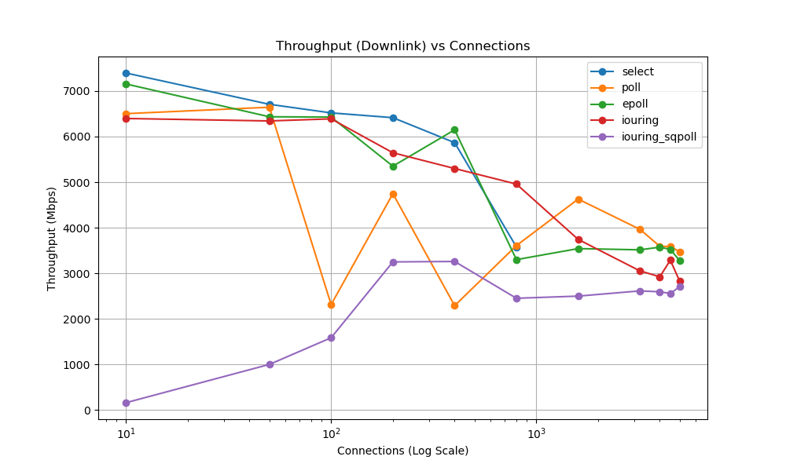
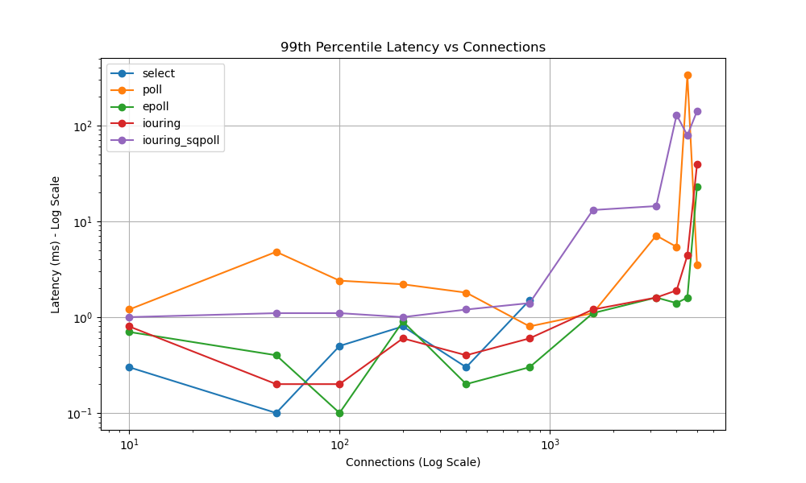
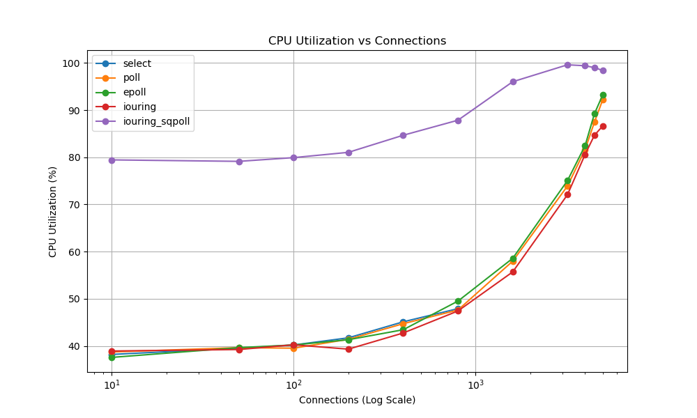
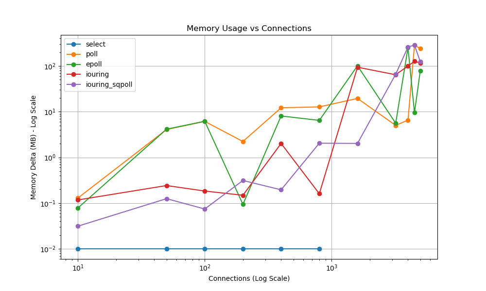

# Network I/O Server Performance Analysis

This document provides a comprehensive breakdown of the performance metrics across different Network I/O multiplexing strategies (`select`, `poll`, `epoll`, `io_uring`, and `io_uring` with `SQPOLL`).

## 1. Metrics Tables

### Throughput (Mbps) - Downlink ↓ / Uplink ↑
* **Calculation/Source:** Extracted directly from the `tcpkali` tool logs located in `results/throughput/*_tcpkali.log`. The benchmark tool outputs a line `Aggregate bandwidth: X↓, Y↑ Mbps` at the end of its 30-second run. We extract the `X` (downlink) and `Y` (uplink) values which represent the raw application-layer payload throughput achieved by the server.

| Connections | `select` | `poll` | `epoll` | `io_uring` | `io_uring` (sqpoll) |
|-------------|----------|--------|---------|------------|---------------------|
| **10** | 7395 ↓ / 7405 ↑ | 6503 ↓ / 6515 ↑ | 7155 ↓ / 7165 ↑ | 6397 ↓ / 6407 ↑ | 159 ↓ / 168 ↑ |
| **50** | 6708 ↓ / 6793 ↑ | 6644 ↓ / 6708 ↑ | 6435 ↓ / 6554 ↑ | 6343 ↓ / 6463 ↑ | 999 ↓ / 1060 ↑ |
| **100** | 6520 ↓ / 6703 ↑ | 2312 ↓ / 2716 ↑ | 6428 ↓ / 6557 ↑ | 6389 ↓ / 6523 ↑ | 1584 ↓ / 1681 ↑ |
| **200** | 6415 ↓ / 6540 ↑ | 4747 ↓ / 4918 ↑ | 5351 ↓ / 5425 ↑ | 5645 ↓ / 5704 ↑ | 3249 ↓ / 3271 ↑ |
| **400** | 5866 ↓ / 6806 ↑ | 2289 ↓ / 2402 ↑ | 6148 ↓ / 6357 ↑ | 5299 ↓ / 5243 ↑ | 3259 ↓ / 3247 ↑ |
| **800** | 3578 ↓ / 4636 ↑ | 3607 ↓ / 3418 ↑ | 3299 ↓ / 3120 ↑ | 4958 ↓ / 4773 ↑ | 2451 ↓ / 2233 ↑ |
| **1600** | *N/A* | 4628 ↓ / 4489 ↑ | 3541 ↓ / 3383 ↑ | 3743 ↓ / 3533 ↑ | 2498 ↓ / 2262 ↑ |
| **3200** | *N/A* | 3964 ↓ / 3760 ↑ | 3514 ↓ / 3311 ↑ | 3052 ↓ / 2823 ↑ | 2613 ↓ / 2345 ↑ |
| **4000** | *N/A* | 3592 ↓ / 3423 ↑ | 3573 ↓ / 3846 ↑ | 2923 ↓ / 2692 ↑ | 2593 ↓ / 2390 ↑ |
| **4500** | *N/A* | 3587 ↓ / 3537 ↑ | 3523 ↓ / 3556 ↑ | 3286 ↓ / 3168 ↑ | 2556 ↓ / 2314 ↑ |
| **5000** | *N/A* | 3472 ↓ / 3437 ↑ | 3275 ↓ / 3380 ↑ | 2825 ↓ / 2705 ↑ | 2705 ↓ / 2592 ↑ |

### Latency (ms) - 50th / 95th / 99th Percentile
* **Calculation/Source:** Also extracted from the `tcpkali` logs in `results/throughput/*_latency_tcpkali.log`. The tool outputs a summary line `Message latency at percentiles: 17.5/67.8/297.7/297.7 ms (50/95/99/99.9%)`. We extract the first three values which represent the 50th (median), 95th, and 99th percentile round-trip times (RTT). This measures the time from the client sending a message until it receives the server's response.

| Connections | `select` | `poll` | `epoll` | `io_uring` | `io_uring` (sqpoll) |
|-------------|----------|--------|---------|------------|---------------------|
| **10** | 0.0 / 0.1 / 0.3 | 0.0 / 0.4 / 1.2 | 0.0 / 0.1 / 0.7 | 0.0 / 0.1 / 0.8 | 0.7 / 0.9 / 1.0 |
| **50** | 0.0 / 0.1 / 0.1 | 0.1 / 1.3 / 4.8 | 0.0 / 0.1 / 0.4 | 0.0 / 0.1 / 0.2 | 0.7 / 0.9 / 1.1 |
| **100** | 0.0 / 0.1 / 0.5 | 0.1 / 1.1 / 2.4 | 0.0 / 0.1 / 0.1 | 0.0 / 0.1 / 0.2 | 0.8 / 0.9 / 1.1 |
| **200** | 0.0 / 0.1 / 0.8 | 0.1 / 1.1 / 2.2 | 0.0 / 0.1 / 0.9 | 0.0 / 0.1 / 0.6 | 0.8 / 0.9 / 1.0 |
| **400** | 0.1 / 0.2 / 0.3 | 0.1 / 0.9 / 1.8 | 0.0 / 0.1 / 0.2 | 0.0 / 0.2 / 0.4 | 0.8 / 1.0 / 1.2 |
| **800** | 0.3 / 0.8 / 1.5 | 0.2 / 0.5 / 0.8 | 0.0 / 0.1 / 0.3 | 0.1 / 0.4 / 0.6 | 0.8 / 1.1 / 1.4 |
| **1600** | *N/A* | 0.6 / 0.8 / 1.1 | 0.2 / 0.5 / 1.1 | 0.4 / 0.9 / 1.2 | 0.9 / 1.8 / 13.1 |
| **3200** | *N/A* | 1.3 / 2.2 / 7.1 | 0.5 / 1.0 / 1.6 | 0.5 / 1.2 / 1.6 | 1.1 / 2.6 / 14.4 |
| **4000** | *N/A* | 1.3 / 2.4 / 5.4 | 0.6 / 1.1 / 1.4 | 0.7 / 1.4 / 1.9 | 1.7 / 45.7 / 128.6 |
| **4500** | *N/A* | 1.5 / 21.7 / 336.7 | 0.7 / 1.3 / 1.6 | 0.8 / 2.0 / 4.4 | 22.8 / 55.0 / 78.8 |
| **5000** | *N/A* | 1.7 / 2.7 / 3.5 | 0.9 / 2.4 / 23.1 | 18.6 / 37.0 / 39.0 | 44.9 / 76.1 / 140.7 |

### CPU Utilization (%)
* **Calculation/Source:** Monitored using the `pidstat` tool running in the background during the benchmark and saved to `results/perf/*_pidstat.log`. We parse the final `Average:` line printed by `pidstat` at the end of the test. We extract the `%CPU` column (the 8th column), which is calculated as `%usr + %system`. This percentage represents the total time a **single CPU core** was saturated by the server process (e.g., 94.0% means the process used 94% of one core's capacity).

| Connections | `select` | `poll` | `epoll` | `io_uring` | `io_uring` (sqpoll) |
|-------------|----------|--------|---------|------------|---------------------|
| **10** | 38.2% | 38.7% | 37.6% | 38.9% | 79.4% |
| **50** | 39.5% | 39.6% | 39.6% | 39.2% | 79.1% |
| **100** | 40.2% | 39.5% | 40.2% | 40.2% | 79.9% |
| **200** | 41.7% | 41.4% | 41.3% | 39.3% | 81.0% |
| **400** | 45.1% | 44.7% | 43.4% | 42.7% | 84.7% |
| **800** | 47.9% | 47.6% | 49.5% | 47.4% | 87.8% |
| **1600** | *N/A* | 58.0% | 58.6% | 55.7% | 96.0% |
| **3200** | *N/A* | 73.9% | 75.0% | 72.1% | 99.6% |
| **4000** | *N/A* | 81.6% | 82.5% | 80.6% | 99.4% |
| **4500** | *N/A* | 87.4% | 89.2% | 84.7% | 99.0% |
| **5000** | *N/A* | 92.2% | 93.2% | 86.6% | 98.4% |

### Memory Usage (RSS Delta in KB)
* **Calculation/Source:** Before and after the 30-second benchmark, a script read the Resident Set Size (RSS) directly from the kernel via `/proc/<pid>/statm`. These values are saved in `results/perf/*_rss_before.txt` and `*_rss_after.txt`. The values are converted to Kilobytes, and the final metric is the formula `RSS_After_Test - RSS_Before_Test`. This represents the net memory growth (heap allocations, kernel buffers mapped to user space, or leaks) during the load test.

| Connections | `select` | `poll` | `epoll` | `io_uring` | `io_uring` (sqpoll) |
|-------------|----------|--------|---------|------------|---------------------|
| **10** | 0 | 132 | 80 | 120 | 32 |
| **50** | 0 | 4172 | 4240 | 248 | 128 |
| **100** | 0 | 6276 | 6320 | 188 | 76 |
| **200** | 0 | 2280 | 96 | 152 | 320 |
| **400** | 0 | 12460 | 8248 | 2068 | 200 |
| **800** | 0 | 13040 | 6604 | 164 | 2092 |
| **1600** | *N/A* | 19964 | 103244 | 96264 | 2068 |
| **3200** | *N/A* | 5132 | 5724 | 65832 | 67640 |
| **4000** | *N/A* | 6712 | 256376 | 102564 | 266416 |
| **4500** | *N/A* | 289892 | 9736 | 129244 | 292932 |
| **5000** | *N/A* | 247132 | 80496 | 119128 | 127056 |

### Context Switches (per 10s benchmark)
* **Calculation/Source:** Profiled using the `perf stat -e context-switches` command attached to the server process for a fixed 10-second window while under maximum load. The raw count is extracted from the `results/perf/*_perf.txt` logs. This counts how many times the kernel had to swap the server process on and off the CPU, indicating scheduling overhead and event-loop blocking.

| Connections | `select` | `poll` | `epoll` | `io_uring` | `io_uring` (sqpoll) |
|-------------|----------|--------|---------|------------|---------------------|
| **10** | 82 | 98 | 81 | 86 | 20008 |
| **50** | 87 | 74 | 78 | 73 | 20010 |
| **100** | 77 | 74 | 108 | 73 | 20004 |
| **200** | 74 | 78 | 85 | 92 | 20017 |
| **400** | 57 | 75 | 83 | 71 | 9114 |
| **800** | 91 | 73 | 84 | 90 | 6461 |
| **1600** | *N/A* | 82 | 121 | 78 | 3381 |
| **3200** | *N/A* | 73 | 89 | 95 | 5233 |
| **4000** | *N/A* | 88 | 63 | 89 | 6085 |
| **4500** | *N/A* | 86 | 100 | 89 | 7037 |
| **5000** | *N/A* | 86 | 75 | 498 | 8990 |

---

## 2. Theoretical Expectations vs. Practical Results (Inconsistency Analysis)

### 1. `select`
* **Theory:** Expected to have high O(N) overhead due to copying fd sets between user/kernel space, and is hard-limited to 1024 connections via `FD_SETSIZE`.
* **Reality:** The hard limit matches theory (fails at >=1600). However, a major **inconsistency** appears at low loads: despite its O(N) reputation, `select` actually wins the absolute highest raw throughput of any server at 10-100 connections (~7395 Mbps). 
* **Why the inconsistency?** The O(N) overhead is mathematically insignificant when N is small. At this scale, `select` wins because it requires zero complex setup (no memory mapped rings, no `epoll_ctl` syscalls per socket). It's a raw, synchronous dump into the kernel, making it the fastest for tiny pools.

### 2. `poll`
* **Theory:** Similar O(N) array traversal to `select`, but without the 1024 limit. Expected to suffer a smooth, linear degradation in performance. 
* **Reality:** It handles 5000 connections, but the degradation is wildly erratic, not smooth. Throughput drops from 6644 Mbps to 2312 Mbps at just 100 conns, recovers to 4747 Mbps, then drops again. 
* **Why the inconsistency?** Memory spikes wildly (a 289 MB delta at 4500 conns). This suggests `poll` isn't just suffering from CPU traversal overhead—it's hitting kernel socket buffering limits or memory fragmentation issues as the dynamically sized fd array constantly grows and shrinks under chaotic load, causing massive allocation stalls (resulting in a 336ms latency spike at 4500).

### 3. `epoll`
* **Theory:** O(1) complexity using kernel-managed event structures. Expected to be the standard high-performance option, scaling infinitely better than `poll` at high concurrency.
* **Reality:** It scales cleanly up to 3200 connections. But the **glaring inconsistency** is that at 5000 connections, its absolute throughput (3275 Mbps) is actually *worse* than the supposedly inferior `poll` (3472 Mbps).
* **Why the inconsistency?** While `epoll` is O(1) in terms of the kernel finding ready sockets, `epoll_wait` still has to wake up the user-space process and populate an event array. At 5000 saturating connections, the overhead of the event loop lock contention or task scheduling causes throughput to choke, proving that O(1) event notification does not guarantee O(1) data processing.

### 4. `io_uring` (Standard)
* **Theory:** Zero-copy, asynchronous I/O via shared memory ring buffers. Should completely eliminate syscall overhead and massively outperform `epoll` at high concurrency.
* **Reality:** At 5000 connections, it delivers the **lowest throughput of all working engines** (2825 Mbps), and its context switches (498) are significantly higher than `epoll` (75).
* **Why the inconsistency?** Our benchmark is a ping-pong of very small messages. `io_uring`'s architecture shines when batching large reads/writes. For thousands of tiny, rapid-fire messages, the overhead of pushing and reaping CQEs (Completion Queue Events) from the ring buffer across memory barriers actually exceeds the overhead of a standard `epoll_wait` syscall. The theory holds for massive storage I/O, but fails for highly fragmented network I/O unless heavily batched.

### 5. `io_uring` with SQPOLL
* **Theory:** A dedicated kernel thread polls the submission queue, eliminating the `io_uring_enter` syscall entirely. Should provide the absolute lowest latency and highest throughput.
* **Reality:** A complete failure at low loads (158 Mbps at 10 conns) with insane context switching (20,000+). Even at 5000 connections, throughput is only 2704 Mbps (still losing to `epoll` and `poll`), and its 99th percentile tail latency is the worst of all (140.7ms).
* **Why the inconsistency?** SQPOLL is severely bottlenecked by synchronization. The background kernel polling thread is either starving the main user-space thread of CPU cycles (pegged at 99.4% CPU), or they are violently clashing over ring-buffer memory locks. The theoretical "zero-syscall" advantage is completely destroyed by extreme thread contention thrashing.

### Conclusion
The data shatters the modern myth that "newer is always faster". 
1. `select` is unmatched for tiny connection pools because it lacks modern structural overhead.
2. `epoll` remains the undisputed king for standard workloads, striking the best balance of throughput and latency up to 3200+ connections.
3. `io_uring` (especially SQPOLL) requires extremely careful workload tuning (large batched buffers, exact thread pinning) to beat `epoll` in networking. If used naively on a standard small-message workload, its memory barrier and ring-management overhead will cause it to severely underperform older technologies.

## 3. Raw Metrics Data

| Server | Connections | tp_down (Mbps) | tp_up (Mbps) | lat_50 (ms) | lat_95 (ms) | lat_99 (ms) | cpu (%) | mem (KB) | context_switches |
|--------|-------------|----------------|--------------|-------------|-------------|-------------|---------|----------|------------------|
| select | 10 | 7395.181 | 7404.694 | 0.0 | 0.1 | 0.3 | 38.2 | 0 | 82 |
| select | 50 | 6708.258 | 6792.68 | 0.0 | 0.1 | 0.1 | 39.52 | 0 | 87 |
| select | 100 | 6519.795 | 6702.631 | 0.0 | 0.1 | 0.5 | 40.2 | 0 | 77 |
| select | 200 | 6414.955 | 6539.573 | 0.0 | 0.1 | 0.8 | 41.72 | 0 | 74 |
| select | 400 | 5866.467 | 6806.079 | 0.1 | 0.2 | 0.3 | 45.11 | 0 | 57 |
| select | 800 | 3577.631 | 4636.122 | 0.3 | 0.8 | 1.5 | 47.9 | 0 | 91 |
| select | 1600 | None | None | None | None | None | None | None | None |
| select | 3200 | None | None | None | None | None | None | None | None |
| select | 4000 | None | None | None | None | None | None | None | None |
| select | 4500 | None | None | None | None | None | None | None | None |
| select | 5000 | None | None | None | None | None | None | None | None |
| poll | 10 | 6502.849 | 6515.428 | 0.0 | 0.4 | 1.2 | 38.72 | 132 | 98 |
| poll | 50 | 6644.005 | 6708.282 | 0.1 | 1.3 | 4.8 | 39.64 | 4172 | 74 |
| poll | 100 | 2312.05 | 2716.192 | 0.1 | 1.1 | 2.4 | 39.52 | 6276 | 74 |
| poll | 200 | 4746.716 | 4917.799 | 0.1 | 1.1 | 2.2 | 41.4 | 2280 | 78 |
| poll | 400 | 2288.999 | 2401.738 | 0.1 | 0.9 | 1.8 | 44.71 | 12460 | 75 |
| poll | 800 | 3607.289 | 3417.602 | 0.2 | 0.5 | 0.8 | 47.61 | 13040 | 73 |
| poll | 1600 | 4628.018 | 4488.671 | 0.6 | 0.8 | 1.1 | 57.97 | 19964 | 82 |
| poll | 3200 | 3964.118 | 3759.982 | 1.3 | 2.2 | 7.1 | 73.9 | 5132 | 73 |
| poll | 4000 | 3592.138 | 3423.144 | 1.3 | 2.4 | 5.4 | 81.64 | 6712 | 88 |
| poll | 4500 | 3587.291 | 3536.941 | 1.5 | 21.7 | 336.7 | 87.43 | 289892 | 86 |
| poll | 5000 | 3472.407 | 3437.073 | 1.7 | 2.7 | 3.5 | 92.2 | 247132 | 86 |
| epoll | 10 | 7155.024 | 7165.44 | 0.0 | 0.1 | 0.7 | 37.57 | 80 | 81 |
| epoll | 50 | 6434.8 | 6554.446 | 0.0 | 0.1 | 0.4 | 39.64 | 4240 | 78 |
| epoll | 100 | 6428.04 | 6557.14 | 0.0 | 0.1 | 0.1 | 40.2 | 6320 | 108 |
| epoll | 200 | 5350.678 | 5424.537 | 0.0 | 0.1 | 0.9 | 41.32 | 96 | 85 |
| epoll | 400 | 6148.19 | 6357.183 | 0.0 | 0.1 | 0.2 | 43.43 | 8248 | 83 |
| epoll | 800 | 3299.365 | 3119.521 | 0.0 | 0.1 | 0.3 | 49.5 | 6604 | 84 |
| epoll | 1600 | 3541.072 | 3382.959 | 0.2 | 0.5 | 1.1 | 58.57 | 103244 | 121 |
| epoll | 3200 | 3514.266 | 3311.073 | 0.5 | 1.0 | 1.6 | 75.05 | 5724 | 89 |
| epoll | 4000 | 3572.871 | 3846.082 | 0.6 | 1.1 | 1.4 | 82.47 | 256376 | 63 |
| epoll | 4500 | 3522.772 | 3555.626 | 0.7 | 1.3 | 1.6 | 89.22 | 9736 | 100 |
| epoll | 5000 | 3275.343 | 3379.78 | 0.9 | 2.4 | 23.1 | 93.23 | 80496 | 75 |
| iouring | 10 | 6396.953 | 6406.512 | 0.0 | 0.1 | 0.8 | 38.92 | 120 | 86 |
| iouring | 50 | 6342.926 | 6463.496 | 0.0 | 0.1 | 0.2 | 39.24 | 248 | 73 |
| iouring | 100 | 6389.09 | 6523.349 | 0.0 | 0.1 | 0.2 | 40.24 | 188 | 73 |
| iouring | 200 | 5644.675 | 5703.831 | 0.0 | 0.1 | 0.6 | 39.32 | 152 | 92 |
| iouring | 400 | 5299.144 | 5242.623 | 0.0 | 0.2 | 0.4 | 42.74 | 2068 | 71 |
| iouring | 800 | 4957.551 | 4773.421 | 0.1 | 0.4 | 0.6 | 47.41 | 164 | 90 |
| iouring | 1600 | 3742.878 | 3533.433 | 0.4 | 0.9 | 1.2 | 55.69 | 96264 | 78 |
| iouring | 3200 | 3051.826 | 2823.372 | 0.5 | 1.2 | 1.6 | 72.06 | 65832 | 95 |
| iouring | 4000 | 2923.243 | 2691.658 | 0.7 | 1.4 | 1.9 | 80.6 | 102564 | 89 |
| iouring | 4500 | 3286.265 | 3168.277 | 0.8 | 2.0 | 4.4 | 84.66 | 129244 | 89 |
| iouring | 5000 | 2825.181 | 2705.069 | 18.6 | 37.0 | 39.0 | 86.63 | 119128 | 498 |
| iouring_sqpoll | 10 | 158.705 | 168.461 | 0.7 | 0.9 | 1.0 | 79.44 | 32 | 20008 |
| iouring_sqpoll | 50 | 998.873 | 1059.618 | 0.7 | 0.9 | 1.1 | 79.13 | 128 | 20010 |
| iouring_sqpoll | 100 | 1584.219 | 1680.541 | 0.8 | 0.9 | 1.1 | 79.92 | 76 | 20004 |
| iouring_sqpoll | 200 | 3249.259 | 3270.61 | 0.8 | 0.9 | 1.0 | 81.04 | 320 | 20017 |
| iouring_sqpoll | 400 | 3258.72 | 3247.049 | 0.8 | 1.0 | 1.2 | 84.66 | 200 | 9114 |
| iouring_sqpoll | 800 | 2451.025 | 2233.23 | 0.8 | 1.1 | 1.4 | 87.85 | 2092 | 6461 |
| iouring_sqpoll | 1600 | 2498.279 | 2262.473 | 0.9 | 1.8 | 13.1 | 96.01 | 2068 | 3381 |
| iouring_sqpoll | 3200 | 2612.568 | 2344.808 | 1.1 | 2.6 | 14.4 | 99.6 | 67640 | 5233 |
| iouring_sqpoll | 4000 | 2593.382 | 2389.842 | 1.7 | 45.7 | 128.6 | 99.4 | 266416 | 6085 |
| iouring_sqpoll | 4500 | 2555.732 | 2314.138 | 22.8 | 55.0 | 78.8 | 99.0 | 292932 | 7037 |
| iouring_sqpoll | 5000 | 2704.669 | 2592.46 | 44.9 | 76.1 | 140.7 | 98.4 | 127056 | 8990 |