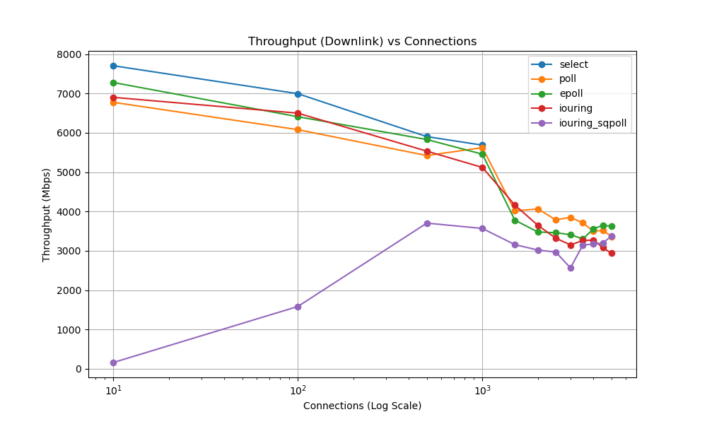
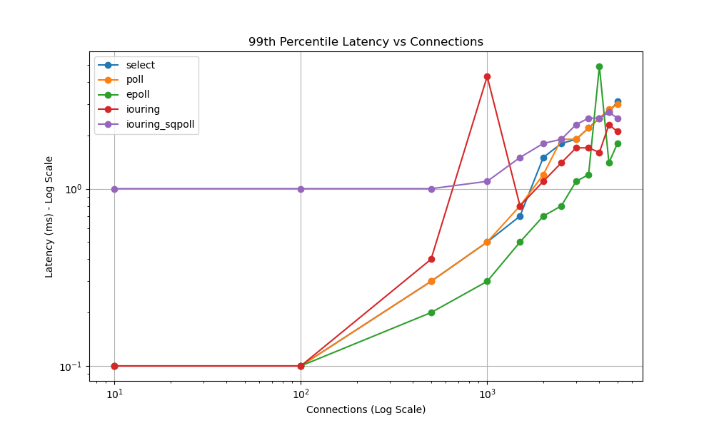
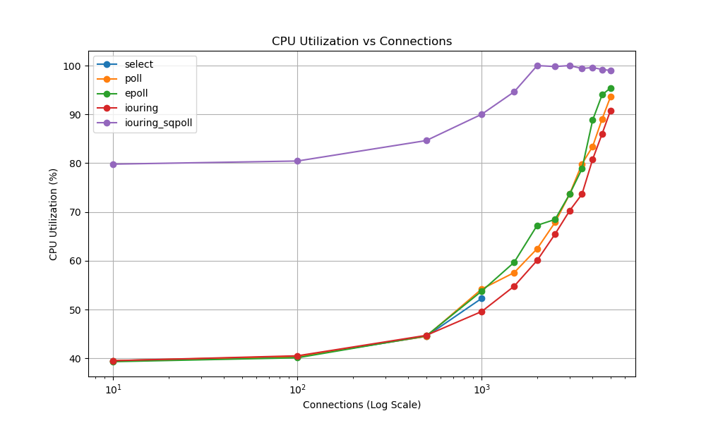
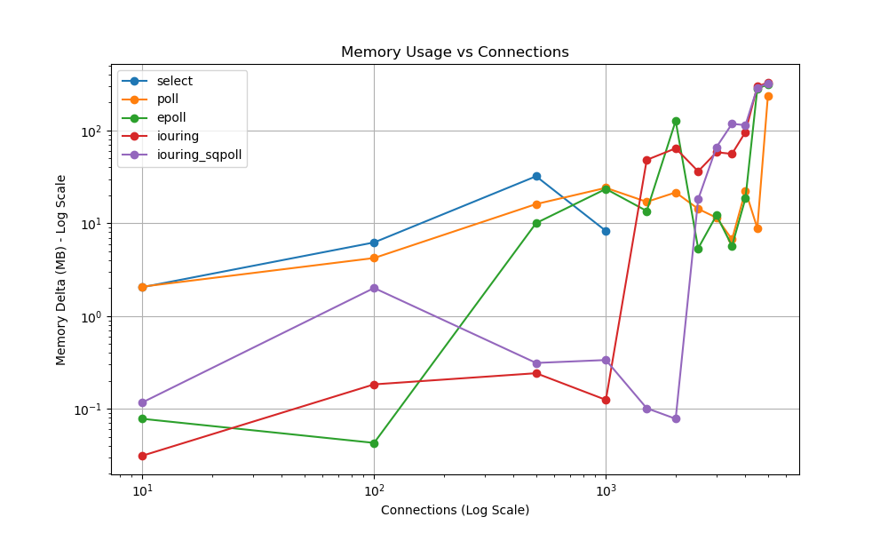

# Network I/O Server Performance Analysis

This document provides a comprehensive breakdown of the performance metrics across different Network I/O multiplexing strategies (`select`, `poll`, `epoll`, `io_uring`, and `io_uring` with `SQPOLL`).

## 1. Metrics Tables

### Throughput (Mbps) - Downlink ↓ / Uplink ↑
* **Calculation/Source:** Extracted directly from the `tcpkali` tool logs located in `results/throughput/*_tcpkali.log`. The benchmark tool outputs a line `Aggregate bandwidth: X↓, Y↑ Mbps` at the end of its 30-second run. We extract the `X` (downlink) and `Y` (uplink) values which represent the raw application-layer payload throughput achieved by the server.

| Connections | `select` | `poll` | `epoll` | `io_uring` | `io_uring` (sqpoll) |
|-------------|----------|--------|---------|------------|---------------------|
| **10** | 7706 ↓ / 7716 ↑ | 6776 ↓ / 6786 ↑ | 7280 ↓ / 7290 ↑ | 6902 ↓ / 6914 ↑ | 159 ↓ / 168 ↑ |
| **100** | 6995 ↓ / 7144 ↑ | 6081 ↓ / 6209 ↑ | 6409 ↓ / 6558 ↑ | 6500 ↓ / 6648 ↑ | 1583 ↓ / 1680 ↑ |
| **500** | 5904 ↓ / 7039 ↑ | 5422 ↓ / 5659 ↑ | 5830 ↓ / 6082 ↑ | 5534 ↓ / 5449 ↑ | 3704 ↓ / 3560 ↑ |
| **1000** | 5686 ↓ / 7060 ↑ | 5623 ↓ / 5593 ↑ | 5457 ↓ / 5408 ↑ | 5120 ↓ / 4917 ↑ | 3568 ↓ / 3366 ↑ |
| **1500** | *N/A* | 4017 ↓ / 3877 ↑ | 3778 ↓ / 3630 ↑ | 4161 ↓ / 3947 ↑ | 3155 ↓ / 2930 ↑ |
| **2000** | *N/A* | 4063 ↓ / 3877 ↑ | 3477 ↓ / 3367 ↑ | 3647 ↓ / 3441 ↑ | 3020 ↓ / 2808 ↑ |
| **2500** | *N/A* | 3786 ↓ / 3628 ↑ | 3461 ↓ / 3299 ↑ | 3319 ↓ / 3089 ↑ | 2968 ↓ / 2723 ↑ |
| **3000** | *N/A* | 3851 ↓ / 3669 ↑ | 3408 ↓ / 3206 ↑ | 3151 ↓ / 2925 ↑ | 2563 ↓ / 2342 ↑ |
| **3500** | *N/A* | 3710 ↓ / 3524 ↑ | 3302 ↓ / 3169 ↑ | 3260 ↓ / 3118 ↑ | 3145 ↓ / 2949 ↑ |
| **4000** | *N/A* | 3497 ↓ / 3351 ↑ | 3555 ↓ / 3662 ↑ | 3272 ↓ / 3155 ↑ | 3175 ↓ / 2962 ↑ |
| **4500** | *N/A* | 3520 ↓ / 3532 ↑ | 3652 ↓ / 3915 ↑ | 3079 ↓ / 2924 ↑ | 3195 ↓ / 2941 ↑ |
| **5000** | *N/A* | 3364 ↓ / 3309 ↑ | 3620 ↓ / 3824 ↑ | 2937 ↓ / 2842 ↑ | 3378 ↓ / 3261 ↑ |

### Latency (ms) - 50th / 95th / 99th Percentile
* **Calculation/Source:** Also extracted from the `tcpkali` logs in `results/throughput/*_latency_tcpkali.log`. The tool outputs a summary line `Message latency at percentiles: 17.5/67.8/297.7/297.7 ms (50/95/99/99.9%)`. We extract the first three values which represent the 50th (median), 95th, and 99th percentile round-trip times (RTT). This measures the time from the client sending a message until it receives the server's response.

| Connections | `select` | `poll` | `epoll` | `io_uring` | `io_uring` (sqpoll) |
|-------------|----------|--------|---------|------------|---------------------|
| **10** | 0.0 / 0.0 / 0.1 | 0.0 / 0.0 / 0.1 | 0.0 / 0.0 / 0.1 | 0.0 / 0.0 / 0.1 | 0.7 / 0.9 / 1.0 |
| **100** | 0.0 / 0.1 / 0.1 | 0.0 / 0.1 / 0.1 | 0.0 / 0.0 / 0.1 | 0.0 / 0.1 / 0.1 | 0.8 / 0.9 / 1.0 |
| **500** | 0.1 / 0.2 / 0.3 | 0.1 / 0.2 / 0.3 | 0.0 / 0.1 / 0.1 | 0.0 / 0.1 / 0.2 | 0.8 / 1.0 / 1.0 |
| **1000** | 0.2 / 0.4 / 0.5 | 0.3 / 0.4 / 0.5 | 0.0 / 0.2 / 0.3 | 0.1 / 0.3 / 0.4 | 0.8 / 1.0 / 1.1 |
| **1500** | *N/A* | 0.5 / 0.6 / 0.9 | 0.1 / 0.3 / 0.4 | 0.2 / 0.6 / 0.8 | 0.8 / 1.5 / 1.6 |
| **2000** | *N/A* | 0.7 / 0.9 / 1.3 | 0.3 / 0.7 / 0.8 | 0.4 / 0.9 / 1.1 | 0.9 / 1.6 / 1.7 |
| **2500** | *N/A* | 0.9 / 1.5 / 1.9 | 0.3 / 0.7 / 0.8 | 0.4 / 1.1 / 1.5 | 1.0 / 1.8 / 2.1 |
| **3000** | *N/A* | 1.1 / 1.7 / 2.2 | 0.5 / 0.9 / 1.0 | 0.5 / 1.1 / 1.4 | 1.0 / 1.9 / 2.3 |
| **3500** | *N/A* | 1.3 / 1.9 / 2.1 | 0.5 / 1.0 / 1.1 | 0.6 / 1.3 / 1.7 | 1.0 / 1.9 / 2.4 |
| **4000** | *N/A* | 1.4 / 2.2 / 2.7 | 0.6 / 1.0 / 1.2 | 0.6 / 1.3 / 1.7 | 1.1 / 2.0 / 2.5 |
| **4500** | *N/A* | 1.5 / 2.4 / 2.9 | 0.7 / 1.3 / 1.5 | 0.7 / 1.5 / 2.0 | 1.0 / 2.0 / 2.9 |
| **5000** | *N/A* | 1.7 / 2.7 / 3.7 | 0.8 / 1.4 / 1.8 | 1.0 / 2.0 / 2.5 | 1.1 / 2.1 / 2.7 |

### CPU Utilization (%)
* **Calculation/Source:** Monitored using the `pidstat` tool running in the background during the benchmark and saved to `results/perf/*_pidstat.log`. We parse the final `Average:` line printed by `pidstat` at the end of the test. We extract the `%CPU` column (the 8th column), which is calculated as `%usr + %system`. This percentage represents the total time a **single CPU core** was saturated by the server process (e.g., 94.0% means the process used 94% of one core's capacity).

| Connections | `select` | `poll` | `epoll` | `io_uring` | `io_uring` (sqpoll) |
|-------------|----------|--------|---------|------------|---------------------|
| **10** | 38.4% | 39.5% | 39.1% | 39.5% | 79.2% |
| **100** | 40.2% | 40.2% | 40.2% | 40.2% | 80.4% |
| **500** | 44.4% | 44.3% | 44.4% | 44.4% | 84.4% |
| **1000** | 50.2% | 54.5% | 52.0% | 49.6% | 89.7% |
| **1500** | *N/A* | 57.6% | 57.4% | 54.8% | 94.8% |
| **2000** | *N/A* | 62.3% | 66.8% | 59.8% | 99.4% |
| **2500** | *N/A* | 72.4% | 72.8% | 64.7% | 100.0% |
| **3000** | *N/A* | 73.3% | 73.9% | 70.3% | 99.8% |
| **3500** | *N/A* | 78.2% | 85.1% | 75.1% | 99.4% |
| **4000** | *N/A* | 84.4% | 83.3% | 80.6% | 99.6% |
| **4500** | *N/A* | 94.0% | 94.2% | 85.5% | 99.2% |
| **5000** | *N/A* | 97.6% | 93.4% | 84.8% | 98.8% |

### Memory Usage (RSS Delta in KB)
* **Calculation/Source:** Before and after the 30-second benchmark, a script read the Resident Set Size (RSS) directly from the kernel via `/proc/<pid>/statm`. These values are saved in `results/perf/*_rss_before.txt` and `*_rss_after.txt`. The values are converted to Kilobytes, and the final metric is the formula `RSS_After_Test - RSS_Before_Test`. This represents the net memory growth (heap allocations, kernel buffers mapped to user space, or leaks) during the load test.

| Connections | `select` | `poll` | `epoll` | `io_uring` | `io_uring` (sqpoll) |
|-------------|----------|--------|---------|------------|---------------------|
| **10** | 0 | 44 | 84 | 56 | 120 |
| **100** | 0 | 2052 | 4100 | 152 | 308 |
| **500** | 0 | 12528 | 8284 | 80 | 44 |
| **1000** | 0 | 14564 | 1612 | 260 | 212 |
| **1500** | *N/A* | 20656 | 9140 | 176 | 320 |
| **2000** | *N/A* | 22028 | 129464 | 24884 | 16548 |
| **2500** | *N/A* | 17300 | 19720 | 45280 | 16440 |
| **3000** | *N/A* | 12316 | 3532 | 98620 | 186460 |
| **3500** | *N/A* | 15412 | 209196 | 92216 | 237796 |
| **4000** | *N/A* | 256060 | 9020 | 270608 | 239616 |
| **4500** | *N/A* | 248844 | 287996 | 301400 | 284968 |
| **5000** | *N/A* | 278564 | 301140 | 55460 | 336036 |

### Context Switches (per 10s benchmark)
* **Calculation/Source:** Profiled using the `perf stat -e context-switches` command attached to the server process for a fixed 10-second window while under maximum load. The raw count is extracted from the `results/perf/*_perf.txt` logs. This counts how many times the kernel had to swap the server process on and off the CPU, indicating scheduling overhead and event-loop blocking.

| Connections | `select` | `poll` | `epoll` | `io_uring` | `io_uring` (sqpoll) |
|-------------|----------|--------|---------|------------|---------------------|
| **10** | 66 | 78 | 83 | 87 | 20006 |
| **100** | 110 | 76 | 75 | 95 | 20005 |
| **500** | 95 | 76 | 75 | 87 | 9998 |
| **1000** | 81 | 90 | 64 | 93 | 5132 |
| **1500** | *N/A* | 70 | 82 | 98 | 2556 |
| **2000** | *N/A* | 82 | 83 | 89 | 2712 |
| **2500** | *N/A* | 81 | 78 | 90 | 3093 |
| **3000** | *N/A* | 88 | 81 | 90 | 3709 |
| **3500** | *N/A* | 91 | 74 | 92 | 6036 |
| **4000** | *N/A* | 83 | 85 | 98 | 5744 |
| **4500** | *N/A* | 86 | 91 | 88 | 6250 |
| **5000** | *N/A* | 90 | 91 | 877 | 7849 |

---

## 2. Raw Metrics Data

| Server | Connections | tp_down (Mbps) | tp_up (Mbps) | lat_50 (ms) | lat_95 (ms) | lat_99 (ms) | cpu (%) | mem (KB) | context_switches |
|--------|-------------|----------------|--------------|-------------|-------------|-------------|---------|----------|------------------|
| select | 10 | 7706.237 | 7715.786 | 0.0 | 0.0 | 0.1 | 38.37 | 0 | 66 |
| select | 100 | 6995.042 | 7144.148 | 0.0 | 0.1 | 0.1 | 40.24 | 0 | 110 |
| select | 500 | 5903.637 | 7038.84 | 0.1 | 0.2 | 0.3 | 44.44 | 0 | 95 |
| select | 1000 | 5686.491 | 7060.106 | 0.2 | 0.4 | 0.5 | 50.2 | 0 | 81 |
| select | 1500 | None | None | None | None | None | None | None | None |
| select | 2000 | None | None | None | None | None | None | None | None |
| select | 2500 | None | None | None | None | None | None | None | None |
| select | 3000 | None | None | None | None | None | None | None | None |
| select | 3500 | None | None | None | None | None | None | None | None |
| select | 4000 | None | None | None | None | None | None | None | None |
| select | 4500 | None | None | None | None | None | None | None | None |
| select | 5000 | None | None | None | None | None | None | None | None |
| poll | 10 | 6775.936 | 6785.876 | 0.0 | 0.0 | 0.1 | 39.52 | 44 | 78 |
| poll | 100 | 6080.569 | 6209.49 | 0.0 | 0.1 | 0.1 | 40.16 | 2052 | 76 |
| poll | 500 | 5421.83 | 5659.215 | 0.1 | 0.2 | 0.3 | 44.33 | 12528 | 76 |
| poll | 1000 | 5622.997 | 5593.142 | 0.3 | 0.4 | 0.5 | 54.49 | 14564 | 90 |
| poll | 1500 | 4016.843 | 3877.128 | 0.5 | 0.6 | 0.9 | 57.57 | 20656 | 70 |
| poll | 2000 | 4063.12 | 3876.59 | 0.7 | 0.9 | 1.3 | 62.28 | 22028 | 82 |
| poll | 2500 | 3785.664 | 3628.492 | 0.9 | 1.5 | 1.9 | 72.37 | 17300 | 81 |
| poll | 3000 | 3851.061 | 3669.09 | 1.1 | 1.7 | 2.2 | 73.31 | 12316 | 88 |
| poll | 3500 | 3709.733 | 3524.382 | 1.3 | 1.9 | 2.1 | 78.24 | 15412 | 91 |
| poll | 4000 | 3496.823 | 3350.812 | 1.4 | 2.2 | 2.7 | 84.4 | 256060 | 83 |
| poll | 4500 | 3519.894 | 3532.054 | 1.5 | 2.4 | 2.9 | 94.01 | 248844 | 86 |
| poll | 5000 | 3363.869 | 3308.889 | 1.7 | 2.7 | 3.7 | 97.61 | 278564 | 90 |
| epoll | 10 | 7280.079 | 7289.587 | 0.0 | 0.0 | 0.1 | 39.12 | 84 | 83 |
| epoll | 100 | 6409.263 | 6558.464 | 0.0 | 0.0 | 0.1 | 40.16 | 4100 | 75 |
| epoll | 500 | 5829.604 | 6081.821 | 0.0 | 0.1 | 0.1 | 44.42 | 8284 | 75 |
| epoll | 1000 | 5456.831 | 5408.315 | 0.0 | 0.2 | 0.3 | 51.99 | 1612 | 64 |
| epoll | 1500 | 3778.057 | 3629.57 | 0.1 | 0.3 | 0.4 | 57.37 | 9140 | 82 |
| epoll | 2000 | 3476.757 | 3367.246 | 0.3 | 0.7 | 0.8 | 66.8 | 129464 | 83 |
| epoll | 2500 | 3460.818 | 3299.092 | 0.3 | 0.7 | 0.8 | 72.76 | 19720 | 78 |
| epoll | 3000 | 3408.227 | 3206.23 | 0.5 | 0.9 | 1.0 | 73.9 | 3532 | 81 |
| epoll | 3500 | 3301.999 | 3168.516 | 0.5 | 1.0 | 1.1 | 85.09 | 209196 | 74 |
| epoll | 4000 | 3555.341 | 3661.822 | 0.6 | 1.0 | 1.2 | 83.27 | 9020 | 85 |
| epoll | 4500 | 3651.827 | 3915.428 | 0.7 | 1.3 | 1.5 | 94.23 | 287996 | 91 |
| epoll | 5000 | 3619.502 | 3823.86 | 0.8 | 1.4 | 1.8 | 93.43 | 301140 | 91 |
| iouring | 10 | 6902.164 | 6913.682 | 0.0 | 0.0 | 0.1 | 39.52 | 56 | 87 |
| iouring | 100 | 6499.999 | 6647.52 | 0.0 | 0.1 | 0.1 | 40.16 | 152 | 95 |
| iouring | 500 | 5533.999 | 5449.121 | 0.0 | 0.1 | 0.2 | 44.42 | 80 | 87 |
| iouring | 1000 | 5119.894 | 4916.91 | 0.1 | 0.3 | 0.4 | 49.6 | 260 | 93 |
| iouring | 1500 | 4160.712 | 3947.015 | 0.2 | 0.6 | 0.8 | 54.78 | 176 | 98 |
| iouring | 2000 | 3646.703 | 3441.327 | 0.4 | 0.9 | 1.1 | 59.76 | 24884 | 89 |
| iouring | 2500 | 3318.581 | 3088.678 | 0.4 | 1.1 | 1.5 | 64.74 | 45280 | 90 |
| iouring | 3000 | 3150.539 | 2925.354 | 0.5 | 1.1 | 1.4 | 70.26 | 98620 | 90 |
| iouring | 3500 | 3260.402 | 3117.772 | 0.6 | 1.3 | 1.7 | 75.1 | 92216 | 92 |
| iouring | 4000 | 3271.733 | 3155.272 | 0.6 | 1.3 | 1.7 | 80.64 | 270608 | 98 |
| iouring | 4500 | 3079.455 | 2924.368 | 0.7 | 1.5 | 2.0 | 85.46 | 301400 | 88 |
| iouring | 5000 | 2936.709 | 2841.931 | 1.0 | 2.0 | 2.5 | 84.75 | 55460 | 877 |
| iouring_sqpoll | 10 | 158.664 | 168.464 | 0.7 | 0.9 | 1.0 | 79.24 | 120 | 20006 |
| iouring_sqpoll | 100 | 1583.355 | 1679.683 | 0.8 | 0.9 | 1.0 | 80.44 | 308 | 20005 |
| iouring_sqpoll | 500 | 3703.888 | 3560.068 | 0.8 | 1.0 | 1.0 | 84.43 | 44 | 9998 |
| iouring_sqpoll | 1000 | 3568.152 | 3365.607 | 0.8 | 1.0 | 1.1 | 89.66 | 212 | 5132 |
| iouring_sqpoll | 1500 | 3155.435 | 2930.235 | 0.8 | 1.5 | 1.6 | 94.81 | 320 | 2556 |
| iouring_sqpoll | 2000 | 3019.599 | 2808.013 | 0.9 | 1.6 | 1.7 | 99.4 | 16548 | 2712 |
| iouring_sqpoll | 2500 | 2968.201 | 2722.503 | 1.0 | 1.8 | 2.1 | 100.0 | 16440 | 3093 |
| iouring_sqpoll | 3000 | 2563.465 | 2342.456 | 1.0 | 1.9 | 2.3 | 99.8 | 186460 | 3709 |
| iouring_sqpoll | 3500 | 3145.04 | 2948.808 | 1.0 | 1.9 | 2.4 | 99.4 | 237796 | 6036 |
| iouring_sqpoll | 4000 | 3175.157 | 2961.794 | 1.1 | 2.0 | 2.5 | 99.6 | 239616 | 5744 |
| iouring_sqpoll | 4500 | 3195.387 | 2941.395 | 1.0 | 2.0 | 2.9 | 99.2 | 284968 | 6250 |
| iouring_sqpoll | 5000 | 3377.512 | 3261.423 | 1.1 | 2.1 | 2.7 | 98.8 | 336036 | 7849 |