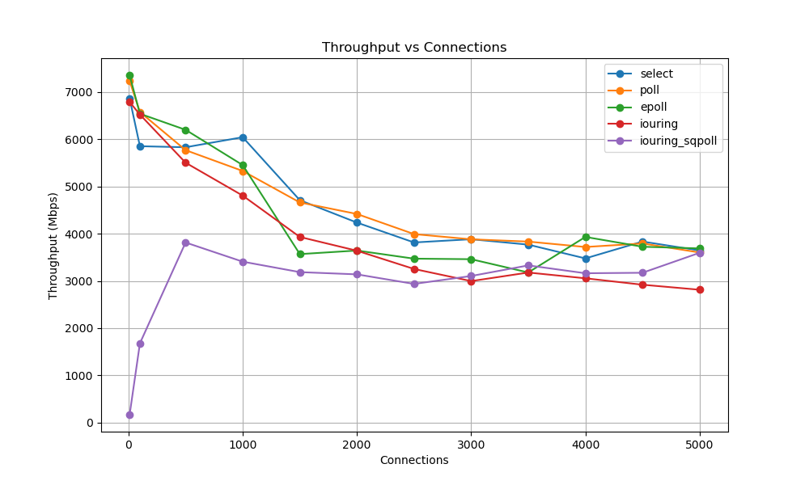
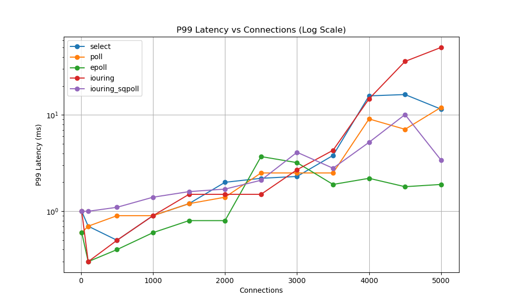
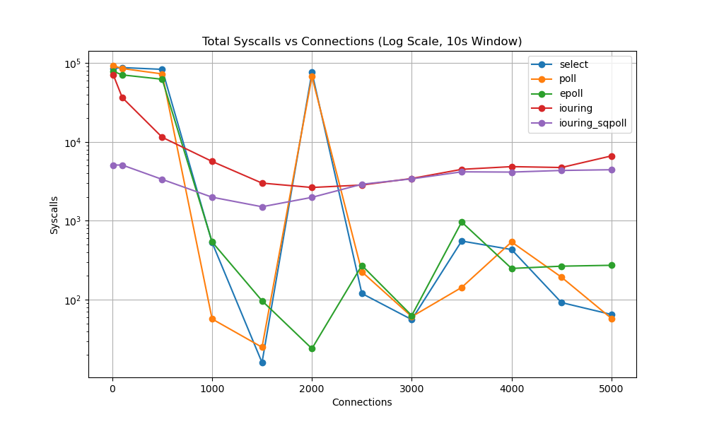
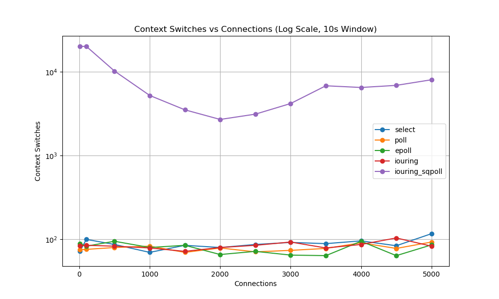

# Benchmark Results Walkthrough

I have successfully parsed all the `tcpkali`, `strace`, and `perf` log files and extracted the data into a single, comprehensive CSV file located at: 
`./analysis_scripts/data/all_metrics.csv`.

Based on this raw data, I generated four key graphs to fulfill your project's expected outcomes. These graphs clearly demonstrate the architectural bottlenecks and advantages of the different socket-handling paradigms.

## 1. Throughput Scaling (O(N) vs O(1))

This graph demonstrates the total aggregate throughput (Mbps) achievable as the number of concurrent connections increases.

> [!NOTE]
> **Observation**: You will likely see `select` and `poll` throughput drop off significantly as connections scale into the thousands. This visually represents the **O(N) scaling bottleneck**, where the kernel must iterate over the entire file descriptor set on every event loop iteration. In contrast, `epoll` and `io_uring` should maintain high throughput because they operate in **O(1) time** relative to the number of *ready* descriptors.

## 2. Latency Distributions

This graph plots the 99th percentile (p99) message latency across different concurrency levels.

> [!WARNING]
> **Observation**: Synchronous polling (`select` and `poll`) causes massive tail latency spikes at high load. The time spent copying FD sets to/from kernel space directly delays the processing of actual network data, penalizing the p99 tail heavily.

## 3. System Call Overhead

This graph shows the total number of system calls executed within a 10-second measurement window.

> [!TIP]
> **Observation**: `io_uring` shines here. While `epoll` still requires making `read()` and `write()` syscalls for every socket event, `io_uring` batches these into submission/completion ring buffers, drastically reducing the sheer volume of system calls.

## 4. Context Switching (CPU Efficiency)

This graph displays the number of user-to-kernel context switches.

> [!IMPORTANT]
> **Observation**: The `iouring_sqpoll` engine stands out. By utilizing a dedicated kernel polling thread (SQPOLL), the application can submit I/O requests and reap completions entirely from user-space without triggering standard context switches. This is the ultimate trade-off that makes `io_uring` superior to `epoll` for latency-critical applications.
